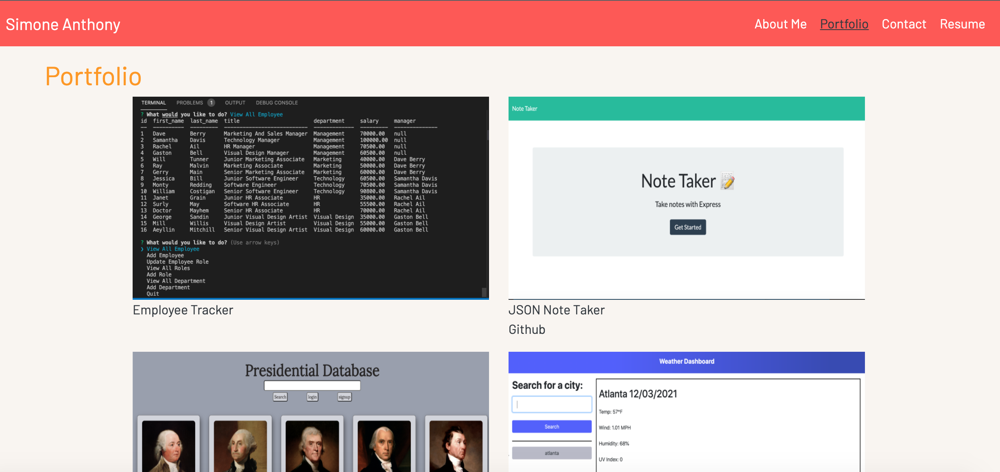

# React Portfolio
## Description
This is a mock porfolio site displaying basic web design and responsive design skills. It utilizes "desktop first" css stylings. It also displays six projects
and a list of frontend skills, backend skills and a resume. It is built in React,
scss, bootstrap and formik.

<!-- This is deployed on github pages:
https://dev.to/yuribenjamin/how-to-deploy-react-app-in-github-pages-2a1f -->

## Visuals

## Deployed Links

* [The URL of the deployed application.](https://simone188535.github.io/React-Portfolio-Homework/)

* [The URL of the GitHub repository.](https://github.com/simone188535/Personal-Portfolio)